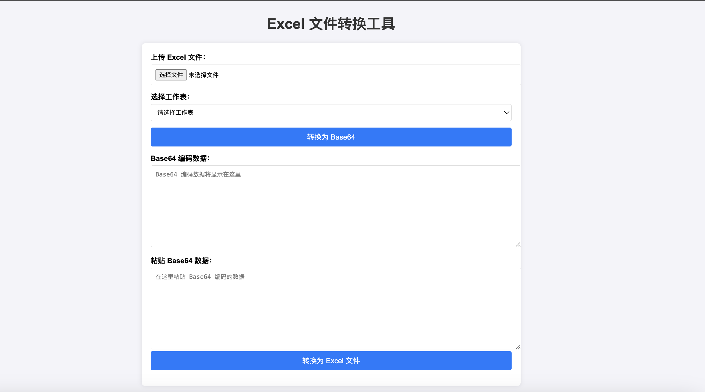

# Excel 文件转换工具

这是一个简单的 Web 工具，允许用户上传 Excel 文件，并将选定的工作表转换为 Base64 编码。此外，它还支持从 Base64 编码数据转换回 Excel 文件。该工具使用了 [xlsx](https://cdnjs.com/libraries/xlsx) 库来处理 Excel 文件的读取和写入。

## 功能

1. **上传 Excel 文件**：选择一个包含多个工作表的 Excel 文件进行上传。
2. **选择工作表**：从上传的 Excel 文件中选择要转换为 Base64 编码的工作表。
3. **转换为 Base64**：将选定的工作表转换为 Base64 编码，并在文本框中显示。
4. **从 Base64 转换为 Excel**：粘贴 Base64 编码数据，并将其转换为 Excel 文件下载。

## 使用方法

1. **上传文件**
   - 点击页面中的“上传 Excel 文件”按钮，选择一个包含多个工作表的 Excel 文件进行上传。

2. **选择工作表**
   - 上传文件后，页面会自动更新下拉框，显示文件中的所有工作表名称。选择你想转换为 Base64 编码的工作表。

3. **转换为 Base64**
   - 选择工作表后，点击“转换为 Base64”按钮。页面将生成 Base64 编码数据并显示在下方的文本框中。

4. **从 Base64 转换为 Excel**
   - 粘贴 Base64 编码数据到“粘贴 Base64 数据”文本框中。
   - 点击“转换为 Excel 文件”按钮，生成的 Excel 文件将自动下载到你的计算机。

## 示例

## 技术栈

- **HTML**：网页结构。
- **CSS**：页面样式美化。
- **JavaScript**：处理文件上传、Base64 编码转换和文件下载。
- **xlsx**：用于读取和写入 Excel 文件的库。

## 注意事项

- 请确保上传的 Excel 文件至少包含一个工作表。
- Base64 编码数据大小会影响下载文件的生成速度。

## 许可证

此项目使用 [MIT 许可证](LICENSE) 开源许可。
